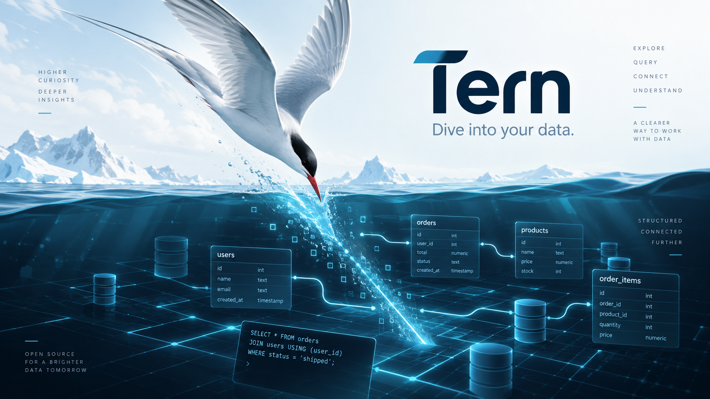

# Tern



**A fast, lightweight, standalone database workbench for SQLite and PostgreSQL, built with Bun and React.**

Tern is a compact, developer-focused database manager inspired by desktop IDEs and workbench-style tools such as Dockyard and DataGrip. It is designed for high information density, fast keyboard-driven workflows, and minimal runtime dependencies.

## Why Tern?

Tern aims to sit between heavyweight database IDEs and overly simple database browsers:

- standalone — no TabTerm runtime or workspace model
- fast startup and low overhead
- native Bun runtime
- direct SQLite and PostgreSQL support
- dense desktop-style UI instead of a SaaS dashboard
- minimal dependencies and simple architecture

## Features

### SQLite and PostgreSQL

- open SQLite database files directly
- save PostgreSQL connection profiles
- environment labels such as Production, Staging, Development, and Local
- read-only connection policies
- connection testing and recent connections

### Database explorer

Browse:

- schemas
- tables
- views
- materialized views
- columns
- indexes
- constraints
- triggers
- sequences
- routines
- extensions
- DDL

### Table browser and editor

- server-side pagination
- filtering and multi-column sorting
- inline editing
- staged inserts, updates, and deletes
- primary/unique-key row identity
- optimistic conflict detection
- generated SQL review
- atomic apply transaction

Tern does not silently write changes when you leave a cell. Mutations remain staged until explicitly applied.

### SQL editor

- multiple SQL tabs
- persisted queries and history
- SQLite/PostgreSQL syntax support
- schema-aware completion
- run statement, selection, or entire editor
- query cancellation and timeouts
- multiple result sets
- query plans / `EXPLAIN`
- execution timing and row counts

### Relationships

- ER-style relationship view
- foreign-key visualization
- pan and zoom
- Mermaid export

### Database insights

For PostgreSQL, Tern can expose operational information such as:

- active sessions
- long-running queries
- connection activity
- table/database statistics
- table sizes
- locks and transaction state where available

### Migration Studio

Tern treats schema changes as a safety-sensitive operation.

Migration Studio supports a workflow like:

```text
write DDL
   ↓
dry run in transaction
   ↓
inspect result
   ↓
rollback
   ↓
explicitly apply migration
```

### Import and export

Import:

- CSV

Export:

- CSV
- JSON
- SQL
- Markdown

## Interface

Tern uses a desktop workbench model:

```text
┌──────────────────────────────────────────────────────────────────┐
│ File Edit View Database Query Tools Help                        │
├──────────────────────────────────────────────────────────────────┤
│ ↻  + SQL   production ▾   shop_db ▾   Read Only                │
├───────────────┬──────────────────────────────────────────────────┤
│ CONNECTIONS   │ users × │ orders × │ Query 1 ×                 │
│               ├──────────────────────────────────────────────────┤
│ ▼ Production  │                                                  │
│   ▼ shop_db   │                  DOCUMENT AREA                   │
│     ▼ Tables  │                                                  │
│       users   │                                                  │
│       orders  │                                                  │
│     Views     │                                                  │
│     Routines  │                                                  │
│               ├──────────────────────────────────────────────────┤
│               │ Results │ Messages │ Query Plan                 │
├───────────────┴──────────────────────────────────────────────────┤
│ PostgreSQL 17 │ host:5432 │ shop_db │ Read only │ 18 ms         │
└──────────────────────────────────────────────────────────────────┘
```

The UI is intentionally compact and low-chrome:

- dock/workbench-style layout
- document tabs
- thin separators instead of large cards
- restrained visual hierarchy
- dense tables and trees
- keyboard-first interactions
- dark theme first

## Stack

- [Bun](https://bun.sh/)
- TypeScript
- React
- Tailwind CSS
- `bun:sqlite`
- Bun SQL / PostgreSQL

Tern deliberately avoids heavyweight backend frameworks, ORMs, state-management frameworks, and large UI component libraries unless they provide clear value.

## Development

```bash
git clone https://github.com/and1truong/tern.git
cd tern
bun install
bun dev
```

Production build:

```bash
bun run build
bun start
```

## Architecture principles

1. **Bun first** — use Bun and browser primitives before adding dependencies.
2. **Explicit server/client boundary** — database access stays on the server side.
3. **No ORM required** — use native SQLite/PostgreSQL capabilities directly.
4. **Safe writes** — database mutations should be deliberate and reviewable.
5. **Desktop semantics** — connections, database objects, and documents are the primary model.
6. **Minimal abstraction** — prefer small focused modules over framework-shaped architecture.

## Status

Tern is under active development.

The project originated from the database-management functionality developed for TabTerm and is being redesigned as a fully standalone application with no TabTerm runtime, workspace, or module-host dependency.

## License

See the repository license for details.
